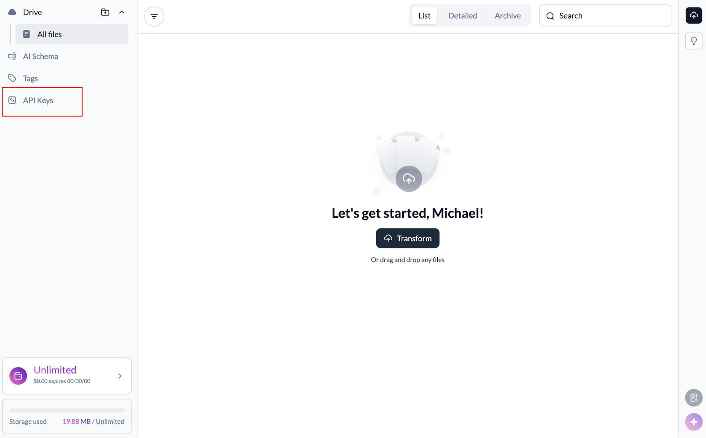
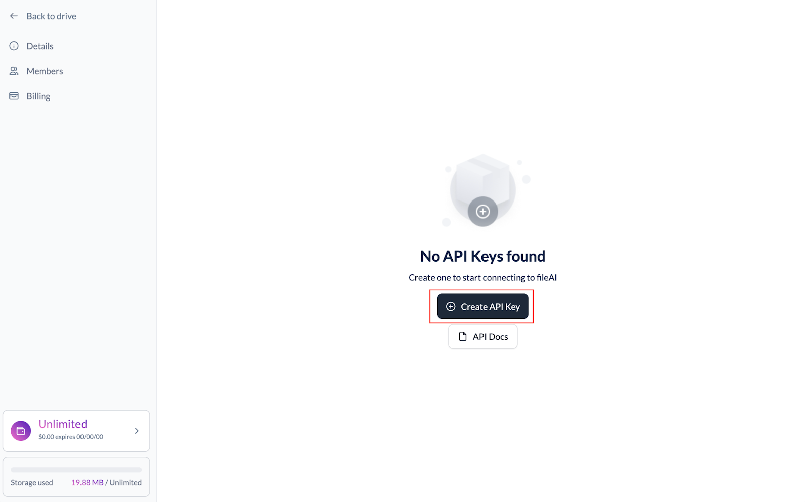
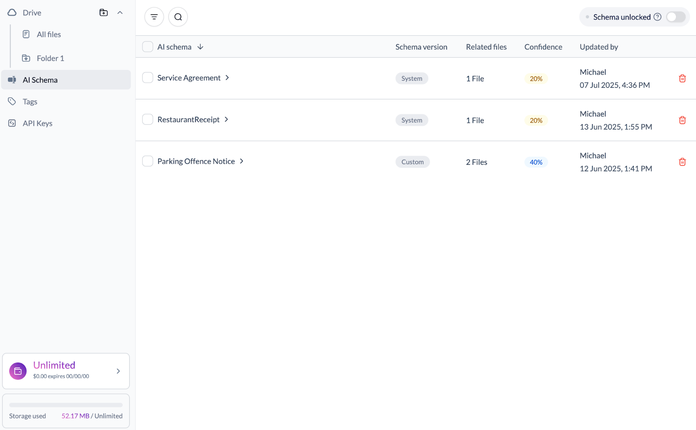
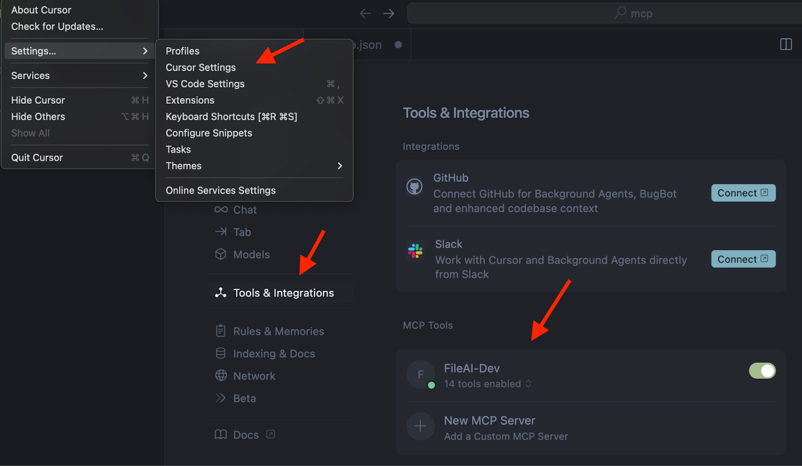
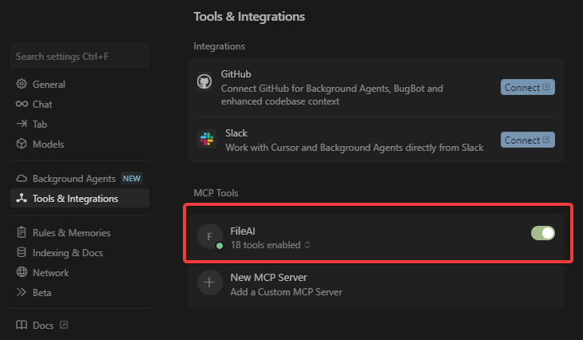
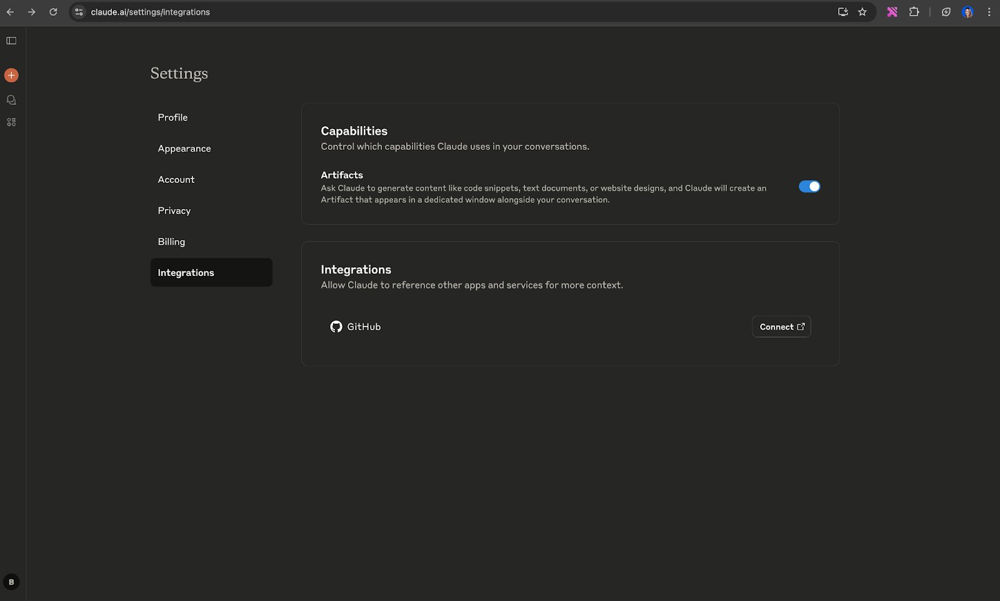

# 📘 fileAI MCP Server Overview

The fileAI MCP Server offers a robust set of tools to work with the fileAI file processing pipeline. It allows for uploading files, performing Optical Character Recognition (OCR), classifying documents, and extracting structured data.
The server leverages the Model Context Protocol (MCP) to provide seamless integration with AI models, enabling them to work with your documents programmatically.

## ✨ Features
* End-to-end File Processing: From file upload to structured data extraction — manage the entire lifecycle of your files
* AI-Powered: Leverage powerful AI models for OCR, file classification, and structured data extraction.
* Schema Management: Define, update, and manage schemas to control how data is extracted for your specific needs
* Asynchronous Processing: Upload files and track processing status asynchronously


## ✅ Requirements
To use the FileAI MCP Server, make sure you have:
* A fileAI account - Sign up or login here (https://orion.file.ai/en/sign-up)

* A fileAI API Key - After creating your fileAI account, you can generate your API Key

* Verified AI Schemas in your fileAI account if you want to receive deterministic responses
    * Our system automatically suggests extraction and data fetch schemas. In our UI, confirm or edit the schema to call it directly

* An MCP client (e.g., Cursor or Claude Desktop)
* npx installed in your environment (usually comes with Node.js)


## ⚙️ Configuration
### 🔧 Configuring Cursor
* HTTP Transport
* Open Cursor Settings (Ctrl/Cmd + ,)
* Navigate to `Tools & Integration → MCP Tools`
* Click `+ New MCP Server`


Use the configuration below:
```json
{
  "mcpServers": {
    "FileAI": {
      "command": "npx",
      "args": [
        "mcp-remote",
        "https://mcp.file.ai",
        "--header",
        "accept: application/json",
        "--header",
        "x-api-key:${API_KEY}"
      ],
      "env": {
        "API_KEY": "<YOUR_FILEAI_API_KEY>"
      }
    }
  }
}
```
Note: Make sure to replace `<YOUR_FILEAI_API_KEY>` with your actual fileAI API key.


Verify that the MCP Server is set up correctly. You should see that tools are enabled.



## 🤖 Configuring Claude
To add the fileAI MCP Server to Claude:
* Go to your Claude Integrations page
* Click `+ Add integration`

* In the URL field, enter:
```
https://mcp.file.ai/sse?x-api-key=Bearer YOUR_API_API_KEY_HERE
```

* Replace YOUR_API_API_KEY_HERE with your actual fileAI API key.




***Please note that Claude has restrictive rules regarding the ability to send PII via MCP. Please ensure that your use case is consistent with Claude’s Terms of Service. 

## 🔍 Getting Help
If you're having issues, please reach out to support@file.ai


